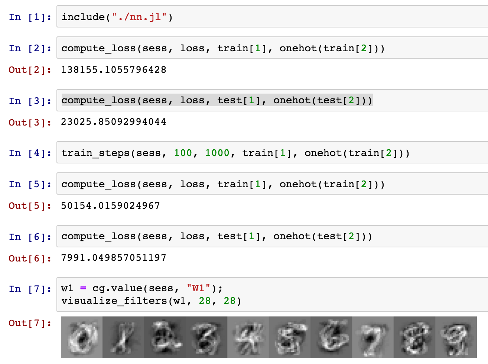

# cg.jl - Computational Graphs in Julia
#
[](https://travis-ci.org/dmrd/cg.jl)

cg.jl is a project to (1) learn Julia, and (2) explore the practical considerations of implementing a deep learning framework.

For now, it only supports CPU computation and the design/API is still in flux (currently a strange cross of Theano, CGT, and Tensorflow).  Many basic operations are implemented, and the next step is to simplify the design and clean up the code.

In the future, I hope to explore graph optimizations, running graphs on a GPU, make better use of Julia's metaprogramming abilities, and experiment with Julia's distributed computing tools.

## Softmax Regression
Simple example showing what softmax regression looks like (in test/nn.jl)
```
function softmax_regression(input_dim::Int, output_dim::Int, step_size::Float64)
    W1 = cg.variable(cg.zeros(cg.constant([output_dim, input_dim])), "W1")
    b1 = cg.variable(cg.zeros(cg.constant(output_dim)), "b1")

    input = cg.placeholder([input_dim], "input")
    label = cg.placeholder([output_dim], "label")
    unnormed = cg.broadcast("+", cg.matmul(W1, input), b1)
    prediction = cg.softmax_stable(unnormed)
    loss = cg.crossentropy(label, prediction)

    train = cg.sgd_optimizer(loss, [W1, b1], cg.constant(step_size))

    (input, label, prediction, loss, train)
end
```


